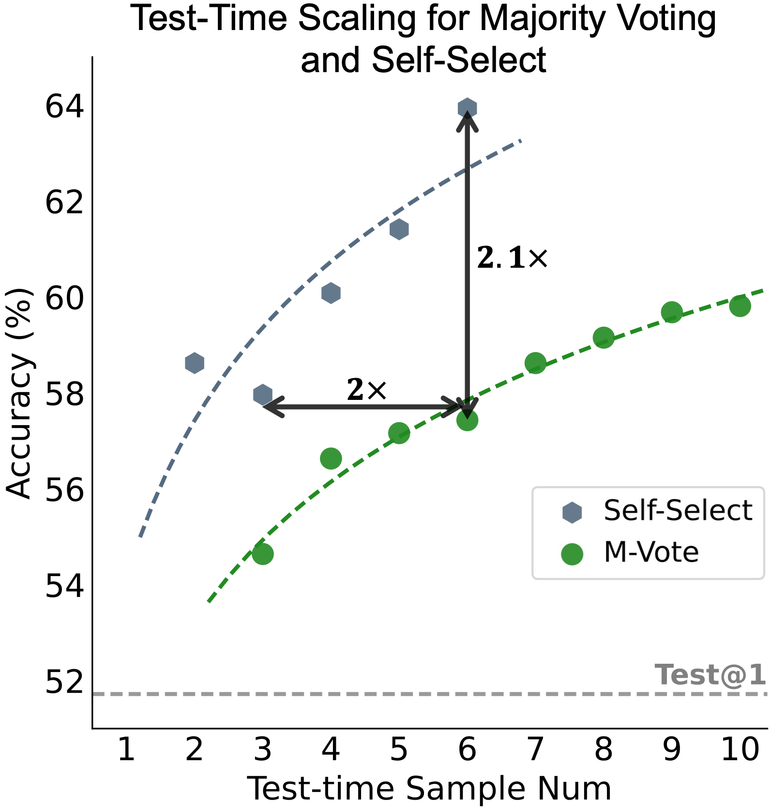

# MM-self-Improve (Qwen2-VL)

## Introduction

This project contains the code for our paper *Vision-Language Models Can Self-Improve Reasoning via Reflection.* 
We present a novel approach for self-improving vision-language models through reflection, which involves training a model to generate explanations for its own predictions and then fine-tuning it based on these explanations. Our method, MM-self-Improve, achieves significant improvements in reasoning tasks. 
We shows the least open-resourced model, Qwen2-VL, can gain significant improvements with our method, and achieves great test-time computation efficiency comparison with majority vote method.

The code is based on the 🤗 [Qwen2-VL-7B-Instruct](https://huggingface.co/Qwen/Qwen2-VL-7B-Instruct) and [LLaMA-Factory](https://github.com/hiyouga/LLaMA-Factory?tab=readme-ov-file) for fine-tuning model. 
You could find the train guide in [Qwen2-VL repository](https://github.com/QwenLM/Qwen2-VL?tab=readme-ov-file#training).
We wrote the inference code with `accelerate` supporting for multiple GPUs on single machine.


## News

- **[November 3, 2024]**: We release the code for MM-self-Improve (Qwen2-VL).

## Performance

### Self-training on GeoQA

The following results illustrate the effectiveness of our self-training framework and its scalability on the GeoQA dataset:

| Method                             | Score  |
|------------------------------------|--------|
| Zero-shot CoT                      | 17.11  |
| Self-Train R3V                    | 51.72  |
| + Test-Time Selection (N=3)       | 57.96  |

### Test-Time Selection Efficiency on GeoQA



The test-time selection method showcases superior scalability, with a performance boost to 57.96 through majority voting and self-selection sampling.


## Quickstart

#### Installation

Following we provide a example to show to to run the self-training code.

The code of Qwen2-VL has been in the latest Hugging face transformers(>=4.45), and for process the inputs, Qwen2-VL requires `qwen-vl-utils` to be installed with pip. 
And the fine-tuning framework is cloned from LLaMA-Factory, requires to build from source code.
We will provide a requirements.txt file for our environment, but we recommend to following the install guide of [Qwen2-VL](https://github.com/QwenLM/Qwen2-VL?tab=readme-ov-file#quickstart) and [LLaMA-Factory](https://github.com/hiyouga/LLaMA-Factory?tab=readme-ov-file#installation) to install the environment.

After those steps, `pyyaml` and `accelerate` are required to be installed.

```bash
pip install pyyaml accelerate
```

#### Data Preparation

Please download our processed GeoQA dataset from [here](https://box.nju.edu.cn/d/e98543150f294501b7fc/)

#### Self-training

The following command shows how to run the self-training code.

```bash
python run.py
```

`run.py` will automatically running our self-training iteration, and the results will be saved in the `outputs` folder. The iteration number is controlled by the for loop range in `run.py`, we set it to 3 in our experiment.

You need to change the config in the `run.py` before running the code.

```python
const_configs = {
    "model_name": 'qwen2-vl',
    # "ckpt_path": 'saves',
    "base_model_path": 'Qwen2-VL-7B-Instruct', # ABS path to model checkpoint
    "dataset": 'geoqa',
    "data_file_pth": 'data',
    "data_utils_dir": 'data_process',
    "geoqa_data_dir": 'geoQA-data', # ABS path to processed geoQA data
    "CUDA_INFO": 'CUDA_VISIBLE_DEVICES=0,1,2,3'
}
```

#### Test-time Selection


We conduct a new self-training iteration on the best model obtained from previous self-training, creating a mixed dataset of self-selection samples.Initially, the self-selection dataset consisted of three samples of the same question from the training set. 

In the new self-selection scaling, we expand this to include 2 to 6 samples, which are then combined into a single file for the next training iteration.

We don't provide the automatic code for this step, you can manually create the mixed dataset and run the fine-tuning code.

##### Build new data

Please modify the `data_process/geoqa/merge_data.py` file to create the mixed dataset.

- Manually manage the `merge_files` list for the generated training/test sample that you want to use. We use all 4 * 3 = 12 samples in our experiment, from base model and iteration 1 to 3.
- Comment out the following lines in `merge_data.py` to avoid generate self-select data for new iteration.
    ```python
    # Build select data
    select_data, select_metric = gen_select_data(merge_datas=merge_datas, merge_correct=files_corrects, origin_data=origin_data, order_list=file_order, data_type=data_type)
    print('='*20)
    print('Generated Select data:')
    print(select_metric)
    print(select_data[0])
    ```
- Uncomment the following lines in `merge_data.py` to generate the mixed dataset.
    ```python
    # For building mixed self-select training samples
    # Build multiple select data
    select_data, select_metric = gen_select_data_n(merge_datas=merge_datas, merge_correct=files_corrects, origin_data=origin_data, order_list=file_order, data_type=data_type,
                                                    n_candidates=[2,3,4,5,6])
    print('='*20)
    print('Generated Select data:')
    print(select_metric)
    print(select_data[0])
    ```
- Run the `merge_data.py` file to generate the mixed dataset. The file should saved in `data/geoqa/self_[train, test]_data`, 
- Run the `data/geoqa/new_data_gen.py` to generate SFT data for LLaMA-Factory, the new data will be saved in `data/geoqa` with your specified filename prefix from cmd arguments.

##### Fine-tuning with LLaMA-Factory

The we need to copy the generated training file and modify the correspond configs to meet the requirements of LLaMA-Factory. 

- Copy the generated training file to `LLaMA-Factory/data` and modify the `LLaMA-Factory/data/dataset_info.json` file to meet the requirements of LLaMA-Factory.

    The example of `dataset_info.json` is as follows:
    ```json
        "geoQA-scale": {
        "file_name": "YOUR_TRAINING_FILE_NAME",
        "formatting": "sharegpt",
        "columns": {
            "messages": "messages",
            "images": "images"
        },
        "tags": {
            "role_tag": "role",
            "content_tag": "content",
            "user_tag": "user",
            "assistant_tag": "assistant"
        }
    }
    ```

-  Modify the training config to load the new data in `qwen2vl_lora_sft_geoqa.yaml`, as you needed.
    ```yaml
    dataset: geoqa-scale # name for the dataset in dataset_info.json
    ...
    model_name_or_path: Qwen2-VL-7B-Instruct
    num_train_epochs: 1
    output_dir: LLaMA-Factory/saves/Qwen2-VL-geoqa-scale
    ```

- Run llama-factory to do sft, in `LLaMA-Factory` folder
    ```bash
    cd LLaMA-Factory
    llamafactory-cli train ../qwen2vl_lora_sft_geoqa.yaml
    ```

The trained model will be saved in `LLaMA-Factory/saves/Qwen2-VL-geoqa-scale`.

##### Test-sampling and Self-selection

The `eval_distributed.py` is used for generate 10 test sampling for inference and self-selection.

```bash
accelerate launch --config_file accelerate_config.json eval_distributed.py \
    --base_model Qwen2-VL-7B-Instruct \
    --lora_path LLaMA-Factory/saves/Qwen2-VL-geoqa-scale \
    --data_file data/geoqa_test_cot.json \
    --save_name qwen2-select-scale \
    --iter_times 10 \
    --with_sampling True 
```


##### Append informations for evaluation

After got 10 test sampling, we need to run`data_process/geoqa/add_test_info.py` to append the information of the test set to the generated test sampling file. Please manually set set the file path.
```python
cot_test_file = 'geoQA-data/test.jsonl'
# cot_test_file = 'geoQA-data/train.jsonl'
adding_file = 'MODEL_OUTPUT_FILE'
```

##### Prepare self-select data

We need to use `gen_select_data` and comment out `gen_select_data_n`, and manually set the `merge_files` list with different number. Here is an example for generate self-select data with 2 samples.
```python
    merge_files = [
        # Sampled training samples or test samples path
        # 'outputs/Qwen2-geoqa_select_scale_sample0.json',
        # 'outputs/Qwen2-geoqa_select_scale_sample1.json',
        # 'outputs/Qwen2-geoqa_select_scale_sample2.json',
        # 'outputs/Qwen2-geoqa_select_scale_sample3.json',
        # 'outputs/Qwen2-geoqa_select_scale_sample4.json',
        # 'outputs/Qwen2-geoqa_select_scale_sample5.json',
        # 'outputs/Qwen2-geoqa_select_scale_sample6.json',
        # 'outputs/Qwen2-geoqa_select_scale_sample7.json',
        'outputs/Qwen2-geoqa_select_scale_sample8.json',
        'outputs/Qwen2-geoqa_select_scale_sample9.json',
    ]
```

```bash
python data_process/geoqa/merge_data.py --d_type test --iter_num n2 --save_dir geoqa  --sample_prefix Qwen2-geoqa_select_scale_sample --original_file geoQA-data/test.jsonl
```

The select data will be saved in `data/geoqa/self_test_data/Qwen2-geoqa_select_scale_sample-n2_select.jsonl`.

#### Evaluation


##### Evaluation with GeoQA

run `data_process/geoqa/calculate.py` to evaluate the results. Please manually set set the file path.
```python
pred_file = 'YOUR_SELF_SELECTION_FILE_PATH'
cot_test_file = 'geoQA-data/test.jsonl' # modify with the abs GeoQA-data path
```

